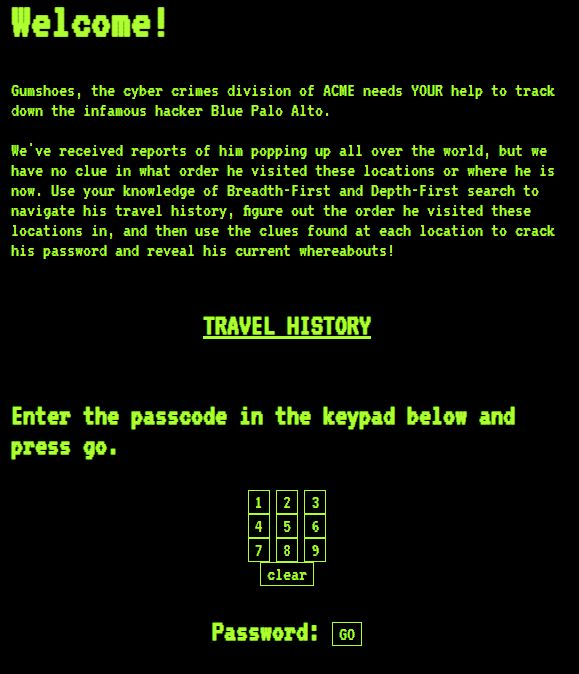

# DON'T START YET -- DRAFT!

# Project 3: Find the Path!

## Overview

In this project you will practice inheritance, graph search, and web
scraping. You'll hand-in a module called `scrape.py`.

Make sure to run the tests before handing in.  During development, we
recommend having a debug.ipynb notebook to make calls to your module.

## Testing

Run `python3 tester.py` often and work on fixing any issues.

## Submission

You'll turn in one file (a Python module), `scrape.py`.  It should
have a comment like the following:

```python
# project: p3
# submitter: ????
# partner: none
# hours: ????
```

`scrape.py` will have the following
* GraphSearcher (a class)
* MatrixSearcher (a class)
* FileSearcher (a class)
* WebSearcher (a class)
* reveal_secrets (a function)

# Group Part (75%)

For this portion of the project, you may collaborate with your group
members in any way (even looking at working code).  You may also seek
help from 320 staff (mentors, TAs, instructor).  You <b>may not</b>
seek receive help from other 320 students (outside your group) or
anybody outside the course.

## Part 1: DFS on Matrices (`MatrixSearcher`)

Complete the lab exercises if you haven't already done so: https://github.com/cs320-wisc/s22/blob/main/labs/lab6.md

## Part 2: BFS on Files (`FileSearcher`)

Add a `bfs_search` to `GraphSearcher`.  It should behave the same as
`dfs_search`, but use the BFS algorithm instead of DFS.  The
difference will be evident at the end if someone looks at the `.order`
attribute.

Note that without changing `MatrixSearcher`, it now supports both DFS
and BFS search since it inherits from `GraphSearcher`.

Add another class, `FileSearcher`, which also inherits from
`GraphSearcher`.  It should have three methods (besides those
inherited): `__init__`, `go`, and `message`.

The nodes of this graph are files in the `file_nodes` directory.  For
example, `1.txt` contains this:

```
M
2.txt,4.txt
```

This means the value for node `1.txt` is "M", and the children of
`1.txt` are `2.txt` and `3.txt`.

All the files will have two lines like this, with a value on the first
line, and a comma-separated list of children on the second line.

The `go` method should read a node file and return a list of children.
For example:

```python
import scrape
f = scrape.FileSearcher()
print(f.go("1.txt"))
```

Expected result: `['2.txt', '4.txt']`.  You could test this by pasting
the sample code to a `debug.ipynb` notebook in your `p3` directory.

`go` will also somehow record the values (1st lines) of the nodes that
are visited, in order.  The `message` method should return all the
values concatenated together.  Take a look at `bfs_test` in
`tester.py` for an example of how this should work.

In general, reading test cases is a great way to see how your classes
are supposed to work.  Specifications, like this document you're
reading now, are sometimes ambiguous (sorry!), but test cases tell you
what is expected from your code with complete precision.

It's often useful to copy/paste code snippets from `tester.py` to your
`debug.ipynb` when your debugging an issue too.

## Part 3: Web Crawling

Don't start this part until we learned about Selenium in class and how
to run it in "headless" mode.

For this part of the project you'll need to install a Chrome Browser
and Chrome Driver onto your VM.

```
pip3 install selenium==4.1.2 beautifulsoup4 Flask lxml html5lib webdriver-manager
sudo apt -y install chromium-browser
```

When it's all done, run both of the following, and verify that both
versions is 98+ (like "98.X.X.X"):

```
chromium-browser --version
chromium.chromedriver --version
```

**Note**: launching many web browsers via code can quickly eat up
  all the memory on your VM.  You can run the `htop` command to see
  how much memory you have (hit "q" to quit when done).  If you're low
  on memory (you might notice your VM being sluggish), you can run
  `pkill -f -9 chromium` shutdown all browser instances hanging around
  in the background.

### TODO TODO TODO TODO `WebSearcher` class

You'll be scraping a website implemented as a web application built
using the flask framework (you don't need to know flask for this
project, though you'll learn it soon and get a chance to build your
own website in the next project).  In an SSH session, run the
following to launch it:

```
python3 application.py
```

Then, open `http://<YOUR-VM-IP>:5000` in your web browser. Do not use the IP address that is output to console in the ssh session. This is incorrect.It should look like this:



Each page (under "TRAVEL HISTORY") contains information in the form of
a table.  If you do either a DFS or BFS search through the site and
concatenate the table rows from the pages in the order in which they're
visited, you'll get a completed table of locations.

Each row in the table contains a 'clue'. Combining these 'clues' in the order shown by the table (first row to last row), will give you a passcode. 

By performing both searches, you'll get two passwords.  Entering
either correct password on the home page will redirect you to a
different page.

Use selenium to do the scraping.  BeautifulSoup is probably also
helpful, though not required.  Start with the following:

```python
class WebSearcher(GraphSearcher):
    # required
    def	__init__(self, driver=None):
        super().__init__()
        self.driver = driver

    # these three can be done as groupwork
    def go(self, url):
        pass

    def dfs_pass(self, start_url):
        pass

    def bfs_pass(self, start_url):
        pass

    # write the code for this one individually
    def protected_df(self, url, password):
        pass
```


**Note**: Make sure to kill the application before running the tester.py. (The tester tries to open an application on the same port!) When you want to kill the application make sure to shut it down via CTRL-C in your ssh session. This will shut it down properly, any other way could result in hangtime errors, so you may have to re-ssh in. As well if your tester.py hangs (never throws an error and stops execution) make sure you kill the command via CTRL-C for the same reason as above. 

### `go` method

Treat each page as a node, and each hyperlink as a directed
edge. Implement the `go` method such that, each time a page is visited the table rows are appended to self.travelLog. 

### `dfs_pass` method

Use the inherited `dfs_search` method to return the DFS travel log (a data frame with rows ordered corresponding to the rows on the visited pages when performing a DFS). 

You may want to use this function: https://pandas.pydata.org/pandas-docs/stable/reference/api/pandas.read_html.html

The method should return the whole DataFrame. 

### `bfs_pass` method

Like the method above, but for BFS. 

### Manual Debugging

Here is a code snippet you can use as you write your methods to help
test whether they're working:

```python
import os
from selenium import webdriver
from selenium.webdriver.chrome.options import Options

# kill previous chrome instance if still around (to conserve memory)
os.system("pkill -f -9 chromium")

options = Options()
options.headless = True
driver = webdriver.Chrome(options=options, executable_path="chromium.chromedriver")

# TODO: use IP address of your VM
start_url = "http://YOUR_IP_HERE:5000/Node_1.html"

s = WebSearcher(driver)
print(s.go(start_url))

dtravellog = s.dfs_pass(start_url)
print("\nDFS Travel Log\n", dtravellog)

btravellog = s.bfs_pass(start_url)
print("\nBFS Travel Log\n", btravellog)

s.driver.close()
```

Expected output:

```
['http://YOUR_IP_ADDRESS:5000/Node_2.html', 'http://YOUR_IP_ADDRESS:5000/Node_4.html']

DFS Travel Log
    clue   latitude   longitude                          description
0     1  43.089034  -89.416128              Picnic Point in Madison
1     7  38.105507  126.910613               Silver Beach in Hawaii
0     1  65.044901  -16.712836  Shore of a Volcanic Lake in Iceland
1     3  48.860945    2.335773                  The Louvre in Paris
0     5  37.434183 -122.321990      Redwood forest in San Francisco
0     4  29.975300   31.137600        Great Sphinx of Giza in Egypt
1     1  47.557600   10.749800     Neuschwanstein Castle in Germany
2     5  38.624700   90.184800        The Gateway Arch in St. Louis
3     3  30.328500   35.444400                      Petra in Jordan
4     2  41.480800   82.683400                    Cedar Point in OH
0     2  27.987586   86.925002                 Mt. Everest in Nepal
1     4  34.134117 -118.321495                 Hollywood Sign in LA
2     5  38.655100   90.061800                 Cahokia Mounds in IL
3     9  40.748400   73.985700          Empire State Building in NY
0     8  51.180315   -1.829659                 Stonehenge in the UK
0     6  43.070010  -89.409450          Quick Trip on Monroe Street

BFS Travel Log
    clue   latitude   longitude                          description
0     1  43.089034  -89.416128              Picnic Point in Madison
1     7  38.105507  126.910613               Silver Beach in Hawaii
0     1  65.044901  -16.712836  Shore of a Volcanic Lake in Iceland
1     3  48.860945    2.335773                  The Louvre in Paris
0     8  51.180315   -1.829659                 Stonehenge in the UK
0     5  37.434183 -122.321990      Redwood forest in San Francisco
0     2  27.987586   86.925002                 Mt. Everest in Nepal
1     4  34.134117 -118.321495                 Hollywood Sign in LA
2     5  38.655100   90.061800                 Cahokia Mounds in IL
3     9  40.748400   73.985700          Empire State Building in NY
0     4  29.975300   31.137600        Great Sphinx of Giza in Egypt
1     1  47.557600   10.749800     Neuschwanstein Castle in Germany
2     5  38.624700   90.184800        The Gateway Arch in St. Louis
3     3  30.328500   35.444400                      Petra in Jordan
4     2  41.480800   82.683400                    Cedar Point in OH
0     6  43.070010  -89.409450          Quick Trip on Monroe Street
```

# Individual Part (25%)

You have to do the remainder of this project on your own.  Do not
discuss with anybody except 320 staff (mentors, TAs, instructor).

## Part 4: `protected_df` method

The method should navigate to the given URL, enter the password into
the keypad, click GO, and return a String identifying the current location. In addition, the method should scrape and download the image of the current location, saving it as 'Current_Location.jpg'. 

Note that after clicking a button, there might be a slight delay
before `driver.page_source` reflects the new page.  Consider how you
can use `time.sleep(...)` to reduce the chance that this will happen
on some systems (like our test machine).

You may consider using the urllibrequest.urlretrieve() function to download the image (https://docs.python.org/3/library/urllib.request.html)

```python
url = "http://YOUR_IP_ADDRESS:5000/"
print(s.protected_df(url, DFS_OR_BFS_PASSWORD_HERE))
```

Should produce this:

```
BASCOM HALL

*AND you should see a 'Current_Location.jpg' appear in your working directory containing the image of the above location. 
```
