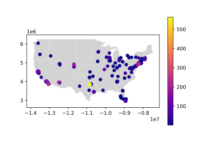

# DRAFT: Don't start yet.

# P5: EDGAR Web Logs

In the US, public companies need to regularly file
various statements and reports to the SEC's (Securities and Exchange
Commission) EDGAR database.  EDGAR data is publicly available online;
furthermore, web requests to EDGAR from around the world are logged
and published.  EDGAR logs are huge.  Logs for *just one day* might be
about 250 MB compressed as a .zip (or 2 GB uncompressed!).

We'll develop tools to extract information from the filings stored in EDGAR (this will be done in a Python module, `edgar_utils.py`) and we'll use those tools to analyze user behavior in `p5.ipynb`.

## Packages

You'll need to install some packages:

```
pip3 install --upgrade pip
pip3 install geopandas shapely descartes geopy netaddr
sudo apt install -y python3-rtree
```

## Testing

Be sure to run `python3 tester.py` regularly to estimate your grade. As in Project 2, the tester will both check the results of the analysis in your notebook, and use `module_tester.py` to check your `edgar_utils.py` module.

## Submission

As before, your notebook should have a comment like this:

```python
# project: p5
# submitter: ????
# partner: none
# hours: ????
```

You'll hand in two files:

- `p5.ipynb`
- `edgar_utils.py`

Combine these into a zip by running the following in the `p5` directory:

```
zip ../p5.zip p5.ipynb edgar_utils.py
```

Hand in the resulting p5.zip file.  Don't zip a different way (our
tests won't run if you have an extra directory inside your zip, for
example).

## Data format

Take a look at the list of daily zips and CSV documentation on the EDGAR site:

- https://www.sec.gov/dera/data/edgar-log-file-data-set.html
- https://www.sec.gov/files/EDGAR_variables_FINAL.pdf

We have provided a `server_log.zip` file, which is a subset of the
records from `log20170101.zip`. Since you'll need to work with a lot of zipped files for this project, you'll want to know some command line techniques
to troubleshoot.

View names of files in a zip file:

```
unzip -l server_log.zip
```

View the start of a file inside of a zip file (change "head" to "tail"
to see the end):

```
unzip -p server_log.zip rows.csv | head -n 5
```

The expected result is:

```
ip,date,time,zone,cik,accession,extention,code,size,idx,norefer,noagent,find,crawler,browser
104.197.32.ihd,2017-01-01,00:00:00,0.0,1111711.0,0001193125-12-324016,-index.htm,200.0,7627.0,1.0,0.0,0.0,10.0,0.0,
208.77.214.jeh,2017-01-01,00:00:00,0.0,789019.0,0001193125-06-031505,.txt,200.0,46327.0,0.0,0.0,0.0,10.0,0.0,
54.197.228.dbe,2017-01-01,00:00:00,0.0,800166.0,0001279569-16-003038,-index.htm,200.0,16414.0,1.0,0.0,0.0,10.0,0.0,
108.39.205.jga,2017-01-01,00:00:01,0.0,354950.0,0000950123-09-011236,-index.htm,200.0,8718.0,1.0,0.0,0.0,10.0,0.0,
```

Looking at the `cik`, `accession`, and `extention` fields tells you what web resoure a user was requesting (in particular, each company has it's own `cik`):

```
ip,date,time,zone,cik,accession,extention,code,size,idx,norefer,noagent,find,crawler,browser,region
54.212.94.jcd,2017-01-01,03:31:36,0.0,1461219.0,0001209191-21-001287,-index.htm,301.0,243.0,1.0,0.0,1.0,10.0,0.0,,United States of America
...
```

For this row, we can construct the following URL from `1461219.0`, `0001209191-21-001287`, and `-index.htm`:

https://www.sec.gov/Archives/edgar/data/1461219/0001209191-21-001287-index.htm

Looking at this page and its source (as well as the source of the pages where your parser does not behave as expected) is highly recommended and will be very important later in the project.

We have already downloaded the docs for a subset of the requests in
`server_log.zip` for you and placed them in `docs.zip`. Note, however, that the file structure is slightly different than the URL above. The path in the zip to that file would be "1461219/0001209191-21-001287/-index.htm".


# Group Part (75%)

# EDGAR Utilities Module

## `lookup_region` function

Your `edgar_utils.py` should have an `lookup_region` function that takes an
IP address (in string form) and returns the region the corresponding computer is in.  It should use the `ip2location.csv` (borrowed from
https://lite.ip2location.com/database/ip-country) to lookup what
country/region owns a particular IP address. The CSV file looks like
this:

```
low,high,code,region
0,16777215,-,-
16777216,16777471,US,United States of America
16777472,16778239,CN,China
16778240,16779263,AU,Australia
16779264,16781311,CN,China
...
```

The first two numbers are IP ranges (inclusive on both ends).  For example, the IP
address 16777473 belongs to China because it is between 16777472 and
16778239.

IP addresses are more commonly represented as four-part numbers, like
"34.67.75.25".  To convert an address like this to an integer, you can
use the following:

```python
import netaddr
int(netaddr.IPAddress("34.67.75.25"))
```

In order to enable us to use this with the anonymized IPs in EDGAR logs, you will need to first process the anonymized IPs.  Some digits are censored as random letters in the dataset.
Any such letters can be replaced with zeros for simplicity (for
example, `104.197.32.ihd` becomes `104.197.32.000`) prior to int conversion.

Because this function will be used many times while processing the logs, it is important to make it fast. Because the IPs in `ip2location.csv` are ordered (both in the `low` and `high` columns), do this with binary search.

Binary search is a very efficient algorithm for searching a sorted list; by taking advantage of that information, it can be much faster than a sequential search (which checks each element, one by one). The difference in speed is dramatic: when searching a sorted array of a billion items, binary search will be tens of millions of times faster.

To apply binary search, use the `searchsorted` method from `numpy` (`numpy` is a very powerful library we'll learn more about later in the semester). The `to_numpy()` method of a column of a `DataFrame` returns a `numpy` array with the contents of the column (the `values` attribute may be used as well); this is actually how numerical `DataFrame` columns are represented under the hood (so the conversion is essentially free).

`array.searchsorted(value)` returns the index of the first item larger than `value`; by applying this to one of the `low` or `high` columns of the ip lookup table in `numpy` form, you can find the index of the range the ip belongs to; by indexing into the table, you can then find the region.

If you're interested, take a look at [the details](https://en.wikipedia.org/wiki/Binary_search_algorithm); implementing it yourself would be a good exercise (but is not required).

Example usage:
```python
>>> lookup_region("1.1.1.x")
'United States of America'
>>> lookup_region("101.1.1.abc")
'China'
```

## `Filing` class

We'll use **regular expressions** (available in Python's `re` module) to extract information from the EDGAR filings. `Filing` should only be used to process ".html" or ".htm" files; however, the processing should be done with regular expressions only (don't use BeautifulSoup) unless specified otherwise. When you're working on processing the files, remember that HTML is just text! Think of the file as a string, and look for patterns which can help you find the information you want.

The processing should be done in a `Filing` class in `edgar_utils.py` of the following form. 

```python
class Filing:
    filing_date_regex = re.compile(???)
    ...

    def __init__(self, path):
        # read the page source from the file with path "path" in docs.zip
        with ZipFile(???) as zf:
            with zf.open(???) as f:
                self.html = ???
        
        # extract the data from the page source
        self.filing_date = ???
        ...
```

Because the regular expressions will be used repeatedly, compiling them once before use with `re.compile(...)` is recommended; make sure this is done only once and not each time a new `Filing` object is created; storing the compiled regular expressions in class variables would be appropriate.

If you name your regular expressions carefully, you might find that `getattr` and `setattr` can be used to cut down on repeated code. Also, since Filing should extract all the information of interest by default, try to process all the ".html" and ".htm" documents in "docs.zip" at the start of your notebook; this will let you re-use the results multiple times.

When processing the files in "docs.zip", make sure to avoid attempting to process the directories. You might find the `filelist` attribute of a `ZipFile` helpful. It returns a list of `ZipInfo` objects, one for each file. Use the `ZipInfo`s `is_dir()` methods to check if the file is a directory, and get its path with the `filename` attribute.

Begin by implementing regular expressions to extract the following information.

- Filing date (store the result in attribute `filing_date` of a `Filing`)
- Date the filing was  accepted (store in attribute `accepted_date`)
- The state of incorporation of the filer (store it in `state_of_incorporation`)

Note: a few of the states of incorporation will not be US states.

**Hints:** Read about the non-greedy * operator (*?); it might be very helpful. 

Using "[^<]" in your regular expressions might also be useful; this will recognise any character except a "<", which is used at the beginning of a tag; "[^>]" could also be useful - it matches any character except a ">" (used at the end of a tag). Both of these might help you write more compact expressions.

Finally, look up `re.DOTALL`; it might be useful for some of the expressions.

## Extract corporate information

Write a regular expression to find the name of the filing company (note that the filing company will appear before other filers such as the legal firms hired by the filer). Store the result in the attribute `company_name` of a `Filing`.

Next, find the industry of the filing company and store it in the attribute `industry`. Note that this isn't shown for some types of filings (for example, investment prospectuses); store "unknown" if not found.

## Extract addresses

Extract the mailing address of the filing company (remember that the primary filer will be before secondary filers in the page). For this component it is not necessary to use a single regular expression; using several regular expressions and non-regex Python is acceptable here (and suggested). Store it in the attribute `address`.

**Hint:** Try to first find the tags containing the address lines (using the non-greedy * operator (*?) might make this much easier; this might also be a good place to use `re.DOTALL`), and next to extract the contents of each of those tags. Get the address by joining the lines together.

Next, find the state abbreviation in the address (remember that the state is prior to the zip code in the last line of the address). Store the result in `state_of_headquarters`. If there is no zip code in the last line, you may assume that the address is not in the US (and does not have a state); store "unknown" in this case.

US-standard zip codes are five digits, optionally followed by a dash and four digits.

Note: a few of the non-US addresses are formatted in a way which is consistent with the US format; this is expected. We could use a list of US state abbreviations to filter them out reliably, but we'll keep them, as the information might be useful.

# Data Analysis

Answer these questions in "p5.ipynb".

## Q1: what's the total size in bytes of the files requested?

We want to count duplicates here; this gives us an estimate of the amount of network traffic handled by EDGAR (since this data is only a sample, the true value will be even larger). Answer with an integer.

## Q2: how many filings have been accessed by the top ten IPs?

Answer with a dictionary, with the (anonymized) IP as key and the number of requests seen in the logs as the values. Each row in the logs corresponds to one request. Note that the anonymized IP addresses are consistent between requests.

**Hint:** for this question and most of the others expecting dictionary output, it might be easiest to use Pandas operations to process the data into a `Series` and to use the `to_dict()` method. Consider using tools like `groupby`, `apply`, and aggregation methods like `count()`.

## Q3: what fraction of the time do errors occur?

Count any request with a status code greater than or equal to 400 as having resulted in an error. Answer with a floating point number.

## Q4: what is the most frequently accessed file?

Answer with a string formatted like so: "cik/accession/extention" (these are the names of columns in "rows.csv".

## Q5: how many requests were made by automated crawlers?

Only count the requests made by users who were identified as crawlers (see the crawler column); considering the results of Q2, this is likely to be a vast underestimate. Answer with an integer.

## Q6: which region uses EDGAR most heavily?

Use your `lookup_region` function and answer with a string.

## Q7: what fraction of IPs in each region are high-volume users?

Consider IPs which accessed more than 1000 EDGAR resoures to be high-volume. This might indicate machines running automated scraping and analysis tasks. 

Note that given the sampling done in the data, the true EDGAR usage of these machines is likely to be even heavier.

Answer with a dictionary, where the keys are the regions and the values are the fraction (in floating point form) of IPs from that region classified as high-volume.

## Q8: find the distribution of the state of incorporation of the companies.

Use `Filing` to extract the data. Do not correct for repeated filings by the same company; answer with a dictionary with the count of each state (the state's abbreviation should be the key, and the count should be the value).

**Hint:** consider using `Counter` from `collections` (a part of the Python standard library).

## Q9: find the number of times filings for each industry were accessed.

Ignore rows in the logs which refer to pages not in `data.zip`. Answer with a dictionary, where the keys are the industry name and the values are the number of times the resources of that industry were accessed. 

**Hint:** try finding the path corresponding to each row (as in Q4) and performing a join on a `Series`. This might work best if the index of the `Series` is the path of a file in "docs.zip" and the values are the corresponding industries.

Use an "inner" join -- this will only keep the rows with a matching path in the `Series` (i.e. those which are in "data.zip"). You can use the `DataFrame` `join` to perform the join; take a look at the documentation -- among other things, the default choice for the "on" argument might not be right.

Alternatively, try writing an `apply` operation which finds the industry from a dictionary of `Filings`.

# Individual Part (25%)

## Q10: how many requests were made in each hour?

Use `pd.to_datetime` (the `hour` attributes of the converted timestamps may be useful) or string manipulation to process the `time` column. Answer with a dictionary, where the keys are integers from 0 to 23 representing the hour of the day, and the values are the number of requests made in that hour.

## Q11: find the distribution of the state of the headquarters of the companies.

Format as with Q8. You might notice that the results here are quite different: perhaps there are advantages to being a Delaware corporation...

## Q12: geographic plotting of headquarters

The `locations.geojson` contains the positions
of some of the headquarters of the corporations in the dataset; you'll need to join on 
the data stored in this file to generate your plot. Take a look at the `geopandas.geocode` function;
it was used to generate this location data. We have pre-computed the results as the services it relies
on have rate limits, but when working with geographic information of your own, it will be a useful tool.

Plot the locations of the headquarters in the continental US (without Alaska) as points, with the color of the point showing the number of times that company's filings were accessed in the logs. Note that requests which have the same "cik" and "accession" as a file in "docs.zip" to the same company (and hence filing); recall how the paths to the files in "docs.zip" were calculated.

The shapefile containing the state boundaries can be found in "shapes/cb_2018_us_state_20m.shp".

Use a Mercator projection; you can do so with the ESPG projection `3395`. You can look it up like this:

```python
import pyproj
crs = pyproj.CRS.from_epsg("3395")
```

You can use `GeoDataFrame.to_crs` to apply a projection. Before projecting, you'll need to crop the data
to the region occupied by the continental US. You can use the following boundaries:

```python
west = -130
east = -55
north = 50
south = 20
```

Use `Polygon` from `shapely.geometry` and the `GeoDataFrame` `clip` method to do the crop.

The result should look like this:



To match these results, remember to sort the geodataframe with the access counts by the column being plotted. This will plot the (more common) companies which are rarely accessed on the bottom, with the most-viewed companies on top. The "plasma" colormap is used.

# Conclusion

The EDGAR logs are supposedly anonymized (with the last three docs
left), but we can still tell where the users live and what they're
looking at.

 By connecting the filing information with the logs, we can learn a lot about the behavior of the investment firms which use the database - for example, we might learn which companies (or industries) a hedge fund might be considering investing in, and the extent to which it relies on automated vs manual research in its trading.

Others have used this same data to make good guesses
about what docs various hedge funds and others are looking at, then
correlate that with success.  For those interested in the nitty-gritty
details of what could be done with this data, take a look at this
early-stage work: [Hedge Funds and Public Information
Acquisition](https://papers.ssrn.com/sol3/papers.cfm?abstract_id=3127825).
