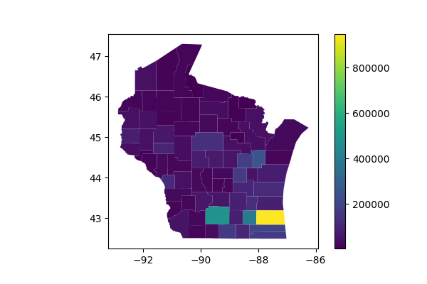
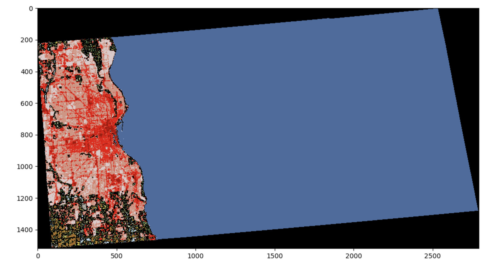
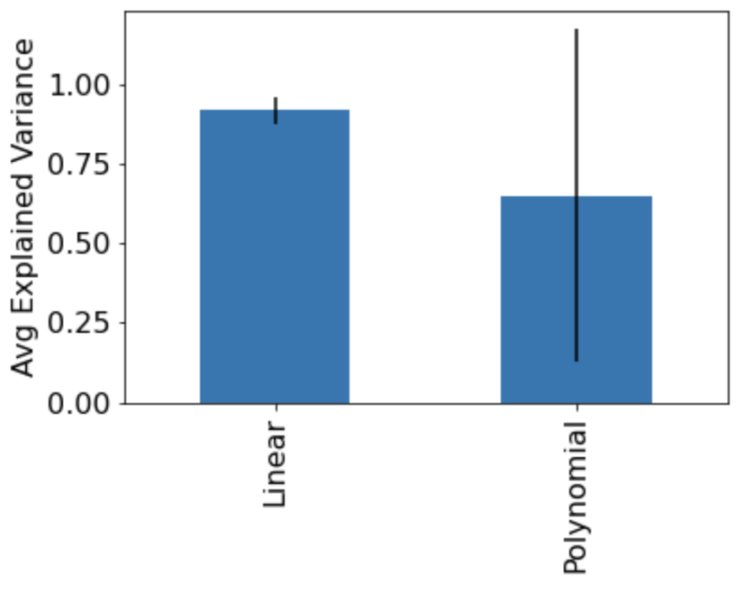

# DRAFT!  Don't start yet.

# Project 6: Regression Models

## Corrections/Clarifications

* None so far!

## Overview

We will be making predictions about census data for Wisconsin using regression models. You'll need to extract data from four files to construct DataFrames suitable for training during this project:

* `counties.geojson` - population and boundaries of each county
* `tracts.geojson` - boundaries of each tract
* `counties_tracts.db` - details about housing units per tract (counties are sub-divided into tracts)
* `land.zip` - details about land use (farm, forest, developed, etc.)

# Group Part (75%)

For this portion of the project, you may collaborate with your group
members in any way (even looking at working code).  You may also seek
help from 320 staff (mentors, TAs, instructor).  You <b>may not</b>
seek receive help from other 320 students (outside your group) or
anybody outside the course.

## Model 1: Area to Population

### Q1: How many counties are in Wisconsin?

Read `counties.geojson` into a GeoDataFrame and use it to calculate the number of counties in Wisconsin.

### Q2: What is the population of each county in WI?

Create a geopandas plot that has a legend using the population from the `POP100` column.




### Dataset 1

Let's construct a dataset we can use to train a model.

Open `counties_tracts.db` by [connecting it to a DB using sqlite3](https://docs.python.org/3/library/sqlite3.html)
then [using `read_sql` on the DB connection to execute a query](https://pandas.pydata.org/docs/reference/api/pandas.read_sql.html).
A great first query for an unfamiliar DB is `pd.read_sql("""SELECT * FROM sqlite_master""", conn)`.  That will show you all the tables the DB has. Try running `pd.read_sql("""SELECT * FROM ????""", conn)` for each table name to see what all the tables look like.

Add a column to your GeoDataFrame specifying `AREALAND` for each county from the `counties_tracts.db` database.

After you've added `AREALAND` to your GeoDataFrame, use `train_test_split` from `sklearn` to split the rows into `train` and `test` datasets.

By default, `train_test_split` randomly shuffles the data differently each time it runs.  Pass `random_state=320` as a parameter so that it shuffles the same way as it did for us (so that you get the answers the tester expects). Pass `test_size=0.25` to make the test set be one quarter of the original data and the other three quarters remaining in the training set.

### Q3: What are the counties in the test dataset?

Answer with a list, in the same order as the names appear in the DataFrame.

### Q4: How much variance in the `POP100` can a `LinearRegression` model predict based only on `AREALAND`?

`fit` the model to your `train` dataset and `score` it on your `test` dataset.

### Q5: What is the predicted population of a county with 500 square miles of area, according to the model?

Consult the [Census documentation](https://tigerweb.geo.census.gov/tigerwebmain/TIGERweb_attribute_glossary.html) to learn what units the data is in, and do any conversions necessary to answer the question:

You can assume there are exactly 2.59 square kilometers per square mile for the purposes of your calculation.

## Model 2: Housing Units to Population

### Dataset 2

Now open the `tracts` table and find the `HU100` column. Add the `HU100` column to your dataset the same way you constructed Dataset 1, with `AREALAND`. Now, have an `HU100` column that specifies housing units per county.

The query to get housing units per county is complicated!  County names are in the `counties` table and `HU100` values are in the `tracts` table.  Fortunately, both tables have a `COUNTY` column you can use to combine. Make sure to get the total number of housing units for each county from the `tracts` table by summing the housing units in each tract of the county.

Split the dataset into a train and test set the same way you did for dataset 1.

### Q6: What are the counties in the test dataset?

Answer with a list, in the same order as the names appear in the DataFrame.

### Q7: What are the HU100 values for the counties in the train dataset?

Answer with a `dict`.

### Q8: How much variance in the `POP100` can a `LinearRegression` model predict based only on `HU100`?

Answer with the average of 5 scores [produced by `cross_val_score` on the training data](https://scikit-learn.org/stable/modules/generated/sklearn.model_selection.cross_val_score.html).

### Q9: What is the standard deviation of the cross validation scores from Q7?

### Q10: What is the formula relating POP100 and HU100?

Fit your model to the training dataset to find the answer. Round the coefficient and intercept to 2 decimal places. Format the answer according to the following formula:

```
POP100 = ????*HU100 + ????
```

### Q11: What is the relationship between HU100 and POP100, visually?

Answer with a scatter plot showing the actual values (both train and test) and the predicted fit line based on the model.

Use a `.text` call to annotate Dane County, and a legend to label the actual and predicted parts as in the following:


## Model 3: Land Use to Population

### Q12: How many numbers in matrix `A` are between 2 and 5 (inclusive)?

You can paste the following to define `A`:

```python
A = np.array([
    [0,0,5,8,4],
    [1,2,4,0,3],
    [2,4,0,9,2],
    [3,5,2,1,1],
    [0,5,0,1,0]
])
```

### Q13: How does Milwaukee County look?

You can show the image like this:

```python
fig, ax = plt.subplots(figsize=(12,12))
ax.imshow(????, vmin=0, vmax=255)
```

You can get the matrix for Milwaukee County using `rasterio` and using the geometry in the data frame from `counties.geojson`.

You can also define a custom color map ([corresponding to the legend](https://www.mrlc.gov/data/legends/national-land-cover-database-2019-nlcd2019-legend) and pass `cmap=custom_cmap` to `imshow` to use it.

You can create a custom color map using `ListedColormap`, which lets you specify red, green and blue (RGB) mixes for different values.  Here's an example for the land use data:

```python
from matplotlib.colors import ListedColormap

c = np.zeros((256,3))
c[0] = [0.00000000000, 0.00000000000, 0.00000000000]
c[11] = [0.27843137255, 0.41960784314, 0.62745098039]
c[12] = [0.81960784314, 0.86666666667, 0.97647058824]
c[21] = [0.86666666667, 0.78823529412, 0.78823529412]
c[22] = [0.84705882353, 0.57647058824, 0.50980392157]
c[23] = [0.92941176471, 0.00000000000, 0.00000000000]
c[24] = [0.66666666667, 0.00000000000, 0.00000000000]
c[31] = [0.69803921569, 0.67843137255, 0.63921568628]
c[41] = [0.40784313726, 0.66666666667, 0.38823529412]
c[42] = [0.10980392157, 0.38823529412, 0.18823529412]
c[43] = [0.70980392157, 0.78823529412, 0.55686274510]
c[51] = [0.64705882353, 0.54901960784, 0.18823529412]
c[52] = [0.80000000000, 0.72941176471, 0.48627450980]
c[71] = [0.88627450980, 0.88627450980, 0.75686274510]
c[72] = [0.78823529412, 0.78823529412, 0.46666666667]
c[73] = [0.60000000000, 0.75686274510, 0.27843137255]
c[74] = [0.46666666667, 0.67843137255, 0.57647058824]
c[81] = [0.85882352941, 0.84705882353, 0.23921568628]
c[82] = [0.66666666667, 0.43921568628, 0.15686274510]
c[90] = [0.72941176471, 0.84705882353, 0.91764705882]
c[95] = [0.43921568628, 0.63921568628, 0.72941176471]
custom_cmap = ListedColormap(c)
```



### Q14: What portion of Milwaukee County is "Open Water"?

Be careful!  Not everything in the matrix is Milwaukee County -- be sure not to count the cells with value 0.

### Q15: What is the Relationship Between POP100 and ________________?

Create a DataFrame called `land_df` where the index contains county names (in the same order they appear in `counties.geojson`) and four columns:

* developed_open
* developed_low
* developed_med
* developed_high
* POP100

The first four columns correspond to land cover codes 21-24 ([refer to the legend](https://www.mrlc.gov/data/legends/national-land-cover-database-2019-nlcd2019-legend)) and should give the number of pixels in a county of the specified type. The geometry in the data frame can be found in `counties.geojson`. The 5th column, `POP100` should also get pulled in from `counties.geojson`.

Plot a scatterplot with `POP100` on the y-axis and one of the development columns of your choosing on the x-axis.

# Individual Part (25%)

You have to do the remainder of this project on your own.  Do not
discuss with anybody except 320 staff (mentors, TAs, instructor).

Use `tracts.geojson` to load the census tracts data. Use this geodata to create a database of the land cover data from your `land_df` data frame. Land use [corresponds to the legend](https://www.mrlc.gov/data/legends/national-land-cover-database-2019-nlcd2019-legend) and is converted to a Python dictionary for your convenience:

```
land_use = {"open_water": 11,
            "ice_snow": 12,
            "developed_open": 21,
            "developed_low": 22,
            "developed_med": 23,
            "developed_high": 24,
            "barren": 31,
            "deciduous": 41,
            "evergreen": 42,
            "mixed_forest": 43,
            "dwarf_scrub": 51,
            "shrub_scrub": 52,
            "grassland": 71,
            "sedge": 72,
            "lichens": 73,
            "moss": 74,
            "pasture": 81,
            "crops": 82,
            "woody_wetlands": 90,
            "herbacious_wetlands": 95}
```

Split the data into train and test sets as before using `random_state=320` for consistency.

### Model Comparison

Fit a linear model to predict how much high density development will be in each area based on 3 other variables of your choice. You may choose any three features to create the _most predictive_ model. You may use any techniques from the class to develop your model.

### Q16 r^2 Analysis

Calculate your model's coefficient of determination (r^2) to determine how well your model performs at the prediction.

### Q17 Comparison Plot

Create a polynomial model of the same features. Compute the five fold cross-validation score of your two models. How consistent are the scores of each model across different folds? Plot the explained variance of each in a single plot to compare their performance. Answer with a plot that has a bar for each model, with error bars indicating standard deviation of scores.



### Q18 Cross Validation

Return the 5-fold cross validation score of your most predictive model. The score of your model determines your score on this section.
